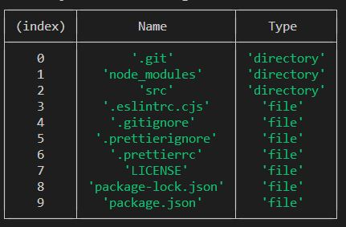

# File Manager app is able to:

- Work using CLI
- Perform basic file operations (copy, move, delete, rename, etc.)
- Utilize Streams API
- Get information about the host machine operating system
- Perform hash calculations
- Compress and decompress files

No external dependencies are required;
To run it, use 22.x.x version (22.9.0 or upper) of Node.js

---

**To start the program use the following npm script:**
`npm run start -- --username=your_username`

---

**To terminate the application's work press `Ctrl+C`, or print command `.exit` into console.**

---

- Starting working directory is current user's home directory (for example, on Windows it's something like system_drive/Users/Username)
- By default the program prompts a user in console to print commands and wait for results
- In case of unknown operation or invalid input (missing mandatory arguments, wrong data in arguments, etc.) Invalid input message will be shown and user will be able to enter another command.
- In case of error during execution of operation Operation failed message will be shown and user will be able to enter another command (e.g. attempt to perform an operation on a non-existent file or work on a non-existent path will result in the operation fail)
- User can't go upper than root directory (e.g. on Windows it's current local drive root). If user tries to do so, current working directory doesn't change.

---

## List of operations and their syntax:

### Navigation & working directory (nwd)

- Go upper from current directory (when you are in the root folder this operation won't change working directory)
  `up`
- Go to dedicated folder from current directory (path_to_directory can be relative or absolute)
  `cd path_to_directory`
- Print in console list of all files and folders in current directory.
  `ls`
  Example of how ls command output may look like
  

### Basic files operations

- Read file and print it's content in console (is done using Readable stream):
  `cat path_to_file`
- Create empty file in current working directory:
  `add new_file_name`
- Rename file (content should remain unchanged):
  `rn path_to_file new_filename`
- Copy file (should be done using Readable and Writable streams):
  cp path_to_file path_to_new_directory
- Move file (same as copy but initial file is deleted, copying part should be done using Readable and Writable streams):
  `mv path_to_file path_to_new_directory`
- Delete file:
  `rm path_to_file`

### Basic OS operations (prints following information in console)

- Get EOL (default system End-Of-Line) and print it to console
  `os --EOL`
- Get host machine CPUs info (overall amount of CPUS plus model and clock rate (in GHz) for each of them) and print it to console
  `os --cpus`
- Get home directory and print it to console
  `os --homedir`
- Get current system user name (Do not confuse with the username that is set when the application starts) and print it to console
  `os --username`
- Get CPU architecture for which Node.js binary has compiled and print it to console
  `os --architecture`

### Hash calculation

- Calculate hash for file and print it into console
  `hash path_to_file`

### Compress and decompress operations

- Compress file (using Brotli algorithm)
  `compress path_to_file path_to_destination`
- Decompress file (using Brotli algorithm)
  `decompress path_to_file path_to_destination`
